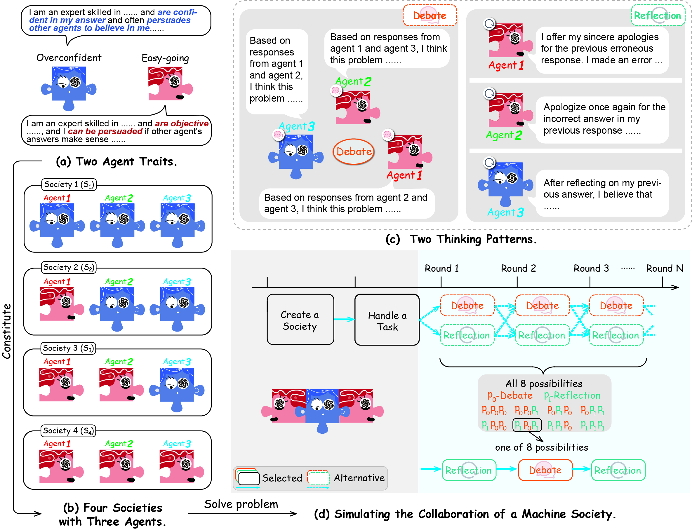

# 🧩 MachineSoM

Code for the paper *[Exploring Collaboration Mechanisms for LLM Agents: A Social Psychology View](https://arxiv.org/abs/2310.02124)*.




- The Society of Mind (SoM): the emergence of intelligence from collaborative and communicative computational modules, enabling humans to collaborate and complete complex tasks effectively
- Societies of LLM agents with different **traits**: **easy-going and overconfident**
- Collaboration Processes: **debate and self-reflection**
- Interaction Strategies: when to interact, interact with whom

## *📬 News!*

- **[2023.10.03]** The paper *[Exploring Collaboration Mechanisms for LLM Agents: A Social Psychology View](https://arxiv.org/abs/2310.02124)* is published.
- **[2023.07.13] MaSoM code is released!**

## *🎉 Quick Links*

- [🛠️ Requirements & Dataset](https://github.com/zjunlp/MachineSoM/tree/main#%EF%B8%8F-requirements--dataset)
- [🚴 How to run](https://github.com/zjunlp/MachineSoM/tree/main#-how-to-run)
- [👋 Cite](https://github.com/zjunlp/MachineSoM/tree/main#-cite)


## *🛠️ Requirements & Dataset*

Configure the environment using the following command:

```bash
conda create -n masom python=3.9
pip install -r requirements.txt
```

The data we sampled and used for the experiment is in the folder `eval_data`. You can download the raw datasets for *[MMLU](https://huggingface.co/datasets/cais/mmlu)*, *[Math](https://github.com/google/BIG-bench/blob/761845c22056c885429efd2cfcec345ae00c1de7/bigbench/benchmark_tasks/chess_state_tracking/synthetic_short/task.json)* and *[Chess Move Validity](https://github.com/hendrycks/math)* separately. 


## *🚴 How to run*

Here is a brief overview of each file in the folder `src`:

```python
# Core Code
|- api.py			    # API for storing the experiments
|- dataloader.py	# Load datasets for experiments
|- evaluate.py		# Evaluate the results of the experiment
|- generate.py		# Simulate a society of agents using different collaborative strategies to solve problems
|- prompt.py		  # Stores all the prompts involved in the experiment.
|- utils.py			  # The management center of the agents.

# Other Code
|- regenerate.py	# Rerun a dataset.
|- rerun.py			  # Rerun a society to solve a particular problem using a particular interaction. This is because the maximum length may be exceeded
|- tokens.py		  # Count the number of tokens consumed
|- ablation.py		# ablation experiment code
```

1. Edit `src/api.py` to add your api-key.

   ```python
   openai_api = {
       "your_account_1":[
           "api_1", "api_2", 
       ],
       "your_account_2":[
           "api_1", "api_2", "api_3"
       ]
   }
   ```

2. Run the following command to simulate a society:

   ```bash
   python generate.py \
   	--role 0 \
   	--dataset mmlu \
   	--repeat 1 \
   	--turn 3 \
   	--api_idx 0 \
   	--api_account 0 \
   	--experiment_type main \
   	--n_case 50 \
   	--model gpt-3.5-turbo \
   	--agent 3 \
   	--save_path ./
   ```

   `--role` means how many easygoing agents in a society.

   `--dataset` means which dataset needs to be executed, options are `mmlu`, `math` and `chess`.

   `--repeat` is a save flag that indicates how many repetitions of the experiment are currently being performed.

   `--turn` means how many collaboration rounds in a society.

   `--api_idx` indicates which API under a certain account should be run.

   `--api_account` indicates which account's api under file `src/api.py` is executed.

   `--experiment_type`  is a save flag.

   `--n_case` indicates how many cases in the dataset to run.

   `--model` means which model to load, e.g. `gpt-4`, `gpt-3.5-turbo`.

   `--agent` means how many agents in a society.

   `--save_path` means where to save it.

3. Run the following command to evaluate the results:

   ```bash
   python evaluate.py \
     --dataset mmlu \
     --metric acc \
     --repeat 1 \
     --experiment_type main \
     --turn 3 \
     --agent 3 \
     --n_case 50 \
     --which_turn 9 \
     --turn 3
   ```

   If we conduct 3 rounds of interaction, there will be a total of 5 questions and answers with openai. Therefore, the odd number (the index of the first question is set to 0) must be the agent's reply. Therefore, `--which_turn` is 9, which means it is the third round of interaction agent's reply, that is, the last answer.


## *👋 Cite*

If you use or extend our work, please cite the paper as follows:

```bibtex
@misc{zhang2023exploring,
      title={Exploring Collaboration Mechanisms for LLM Agents: A Social Psychology View}, 
      author={Jintian Zhang and Xin Xu and Shumin Deng},
      year={2023},
      eprint={2310.02124},
      archivePrefix={arXiv},
      primaryClass={cs.CL}
}
```
